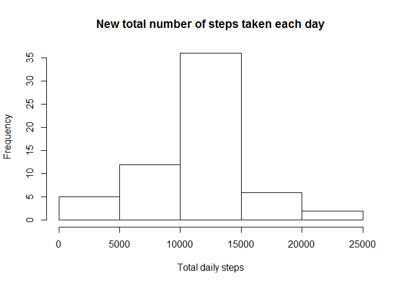

# Reproducible Research: Peer Assessment 1


## Loading and preprocessing the data
Show any code that is needed.

First, here are all the libraries required to run this assignment properly:

```r
suppressMessages(library(dplyr))
library(lubridate)
library(lattice)
```

1.Load the data (i.e. read.csv())

```r
# Working folder
setwd("C:/Users/logo403/Documents/R/work/data_repro/assignment1/")

# Load,unzip and read the data
activity <- read.csv(unzip("./repo/RepData_PeerAssessment1/activity.zip"))
```

2. Process/transform the data (if necessary) into a format suitable for your analysis

```r
# Format date
activity$date <-as.Date(activity$date)
```

## What is mean total number of steps taken per day?
Ignore the missing values in the dataset.

1. Make a histogram of the total number of steps taken each day

```r
# Total number of steps taken per day
sumstepday <- aggregate(steps ~ date, data = activity, FUN = sum)
# Make a histogram of the total per day
hist(sumstepday$steps, 
     main = "Total number of steps taken each day",
     xlab = "Total daily steps")
```

 

```r
# To print the histogram in the figure folder
png(file="./figure/hist_raw.png")
hist(sumstepday$steps, 
     main = "Total number of steps taken each day",
     xlab = "Total daily steps")
dev.off()
```


2. Calculate and report the mean and median total number of steps taken per day

```r
meansteps <- mean(sumstepday$steps)
mediansteps <- median(sumstepday$steps)
```
The mean of the total number of steps taken per day is 10766.2 while the median is equal to 10765.

## What is the average daily activity pattern?

1. Make a time series plot (i.e. type = "l") of the 5-minute interval (x-axis) and the average number of steps taken, averaged across all days (y-axis)

```r
# Average number of steps per interval
meanstepinter <- aggregate(steps ~ interval, data = activity, FUN = mean)

# Plot time series
plot(meanstepinter,type="l", 
     main = "Daily average steps taken per 5-minute interval",
     xlab = "5-minute interval", ylab = "Average number of steps")
```

 

```r
# To print the time series in the figure folder
png(file="./figure/time_series.png")
plot(meanstepinter,type="l", 
     main = "Daily average steps taken per 5-minute interval",
     xlab = "5-minute interval", ylab = "Average number of steps")
dev.off()
```


2. Which 5-minute interval, on average across all the days in the dataset, contains the maximum number of steps?

```r
# max interval
 maxint <- meanstepinter[which(meanstepinter$steps ==
                                       max(meanstepinter$steps)),]$interval
```
On average across all the days in the dataset, the 5-minute interval with the maximum number of step is 835.

## Imputing missing values
Number of days/intervals where there are missing values (coded as NA). The presence of missing days may introduce bias into some calculations or summaries of the data.

1. Calculate and report the total number of missing values in the dataset (i.e. the total number of rows with NAs)

```r
# The number of missing intervals
nbmiss <- sum(is.na(activity))

# The number of missing days
# number of missing intervals
nbdaymiss <- length(unique(activity$date)) - length(unique(sumstepday$date))
```
The number of missing values in the dataset, i.e. intervals or rows with NAs, is 2304 and the number of full missing days in the dataset is 8. 

2. Devise a strategy for filling in all of the missing values in the dataset: the mean for that 5-minute interval.

```r
# impute the mean of 5-minute interval
# step one calculate the average 5-minute interval and rename steps to meansteps
meanstepinter <- aggregate(steps ~ interval, data = activity, FUN = mean)
```


3. Create a new dataset that is equal to the original dataset but with the missing data filled in.

```r
# rename the previous file
colnames(meanstepinter) <- c("interval","meansteps")
# merge the average file to the activity file, impute and create a new activity
# file
transit <- merge(activity,meanstepinter,by="interval")
activity_new <- transit %>% arrange(date) %>% 
        mutate(steps = ifelse(is.na(steps),meansteps,steps)) %>%
        select(steps,date,interval)
```


4. Make a histogram of the total number of steps taken each day. 

```r
# Total number of steps taken per day
sumstepday_new <- aggregate(steps ~ date, data = activity_new, FUN = sum)
# Make a histogram of the total per day
hist(sumstepday_new$steps, 
     main = "New total number of steps taken each day",
     xlab = "Total daily steps")
```

 

```r
# To print the histogram with imputation in the figure folder
png(file="./figure/hist_impute.png")
hist(sumstepday_new$steps, 
     main = "New total number of steps taken each day",
     xlab = "Total daily steps")
dev.off()
```

5. Calculate and report the mean and median total number of steps taken per day.

```r
# Mean and median of the total number of steps taken per day
meansteps_new <- mean(sumstepday_new$steps)
mediansteps_new <- median(sumstepday_new$steps)
```
The mean of the total number of steps (with imputation) taken per day is 10766.2 while the median is equal to 10766.2.


6. Do these values differ from the estimates from the first part of the assignment? What is the impact of imputing missing data on the estimates of the total daily number of steps?


```r
diffmean <- meansteps - meansteps_new
diffmedia <- mediansteps - mediansteps_new
```
The differences between the mean and the median before and after imputation are respectively 0 and -1.1886792.
What appears strange is the post-imputation equality between the median and the mean. But as shown above, there are 8 full days that were imputed and had an identical total number of steps (in the middle of the distribution). 

## Are there differences in activity patterns between weekdays and weekends?
For this part the weekdays() function may be of some help here. Use the dataset with the filled-in missing values for this part.

1. Create a new factor variable in the dataset with two levels -- "weekday" and "weekend" indicating whether a given date is a weekday or weekend day.

```r
newfactor <- activity_new %>% 
        mutate(wdfact = as.factor(ifelse(wday(date) == 1 | wday(date) == 7,
                                         "weekend","weekday")))
```


2. Make a panel plot containing a time series plot (i.e. type = "l") of the 5-minute interval (x-axis) and the average number of steps taken, averaged across all weekday days or weekend days (y-axis). 

```r
# First, derive the averaged across weekday and weekend
aggweekday <- aggregate(steps ~ interval + wdfact, data = newfactor, FUN=mean)

# Plot the data
xyplot(steps ~ interval | wdfact, data=aggweekday, type="l", 
       layout= c(1,2), xlab = "Interval", ylab = "Number of steps")
```

 

```r
# To print the panel weekend vs weekday in the figure folder
png(file="./figure/panel.png")
xyplot(steps ~ interval | wdfact, data=aggweekday, type="l", 
       layout= c(1,2), xlab = "Interval", ylab = "Number of steps")
dev.off()
```
